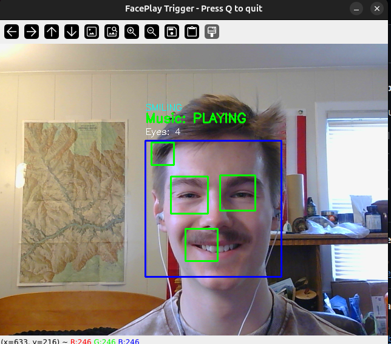

# FacePlay Trigger



> Uses your webcam to recognize facial expressions and instantly trigger music or video playback. Whether it's a smirk, eyebrow raise, or "Zoolander face," FacePlay lets your face control your vibe.

## Features

- **Real-time facial expression detection** using MediaPipe
- **Eyebrow raise detection** - triggers YouTube video playback  
- **Wink detection** - triggers local audio file playback
- **Configurable expressions** via JSON config file
- **Simple single-script implementation** - no complex setup required

## Requirements

- Python 3.7+
- Webcam
- Ubuntu 24.04 or later (tested)

## Installation

1. Clone or download this repository
2. Install dependencies:
   ```bash
   pip install -r requirements.txt
   ```

## Usage

1. Run the application:
   ```bash
   python main.py
   ```

2. The webcam window will open showing your face with green mesh overlay
3. Try the following expressions:
   - **Raise your eyebrows** - Opens a YouTube video in your browser
   - **Wink** - Plays local audio file (if `default_music.mp3` exists)

4. Press 'Q' to quit

## Configuration

Edit `config.json` to customize expressions and actions:

```json
{
  "expressions": {
    "eyebrow_raise": {
      "action": "play_youtube",
      "media_path": "https://www.youtube.com/watch?v=YOUR_VIDEO_ID",
      "description": "Eyebrow raise triggers YouTube video"
    },
    "wink": {
      "action": "play_local", 
      "media_path": "path/to/your/music.mp3",
      "description": "Wink triggers local music"
    }
  },
  "settings": {
    "detection_confidence": 0.7,
    "expression_threshold": 0.15
  }
}
```

### Actions Available:
- `play_youtube` - Opens YouTube URL in default browser
- `play_local` - Plays local audio file using pygame

## File Structure

- `main.py` - Main application (single script)
- `config.json` - Expression and action configuration
- `requirements.txt` - Python dependencies
- `README.md` - This file

## Tips

- **Good lighting** improves facial detection accuracy
- **Face the camera directly** for best results
- **Wait 2 seconds** between triggers (cooldown period)
- **Adjust `expression_threshold`** in config.json if detection is too sensitive/insensitive

## Troubleshooting

- **No camera detected**: Check camera permissions and ensure no other apps are using the webcam
- **Expression not detected**: Try adjusting the `expression_threshold` value in config.json
- **Audio not playing**: Ensure the audio file path is correct and the file exists

## Dependencies

- `opencv-python` - Computer vision and webcam access
- `mediapipe` - Google's facial landmark detection
- `numpy` - Numerical computations
- `pygame` - Audio playback

---

**Made for facial expression enthusiasts and music lovers! 🎵😄**
